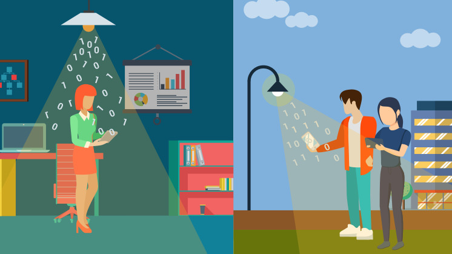
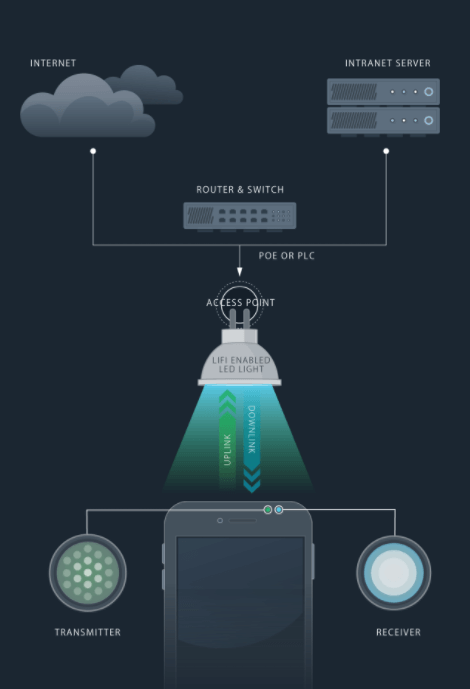

### Li-Fi (Light Fidelity)

## Apa itu Lifi?

Light Fidelity atau yang sering di singkat LiFi merupakan teknologi yang komunikasi nirkabel dua arah. beda dengan teknologi Wi-Fi yang menggunakan sinyal radio untuk berkomunikasi LiFi memanfaatkan cahaya untuk berkomunikasi. kecepatan internet dari lifi bisa mengalahkan wifi dengan 224s lebih besar dari pada wifi. Lifi dibuat menyerupai bola lampu LED yang ada di rumah atau di kantor etsss tetapi Lampu LiFi dilengkapi dengan chip yang memodulasi cahaya untuk pengirim data optik.LIFi pertama kali di temukan oleh Harald Haas di tahun 2011

## Bagaimana Bisa Berkecepatan Tinggi Dan Bagaimana Cara Kerjanya
Alasan mengapa lifi bisa sangat capat adalah karena lampu yang di lengkapi dengan LIFI mampu berganti menyala atau mati hanya dalam waktu beberapa nanodetik setara dengan 1Gits/s yang artinya lebih cepat 10 kali dari wifi yang hanya bisa mencapai kecepatan 100Mbits/s. Cara kerjanya lifi membutuhkan 2 penghubung Satu yang dari lifi sendiri dan yang satu lagi yang terdapat pada perngkat yang akan menerima pertama lifi akan mendapatkan internet dan mengirim data tersebut melalaui cahaya setelah itu cahaya tersebut di tangkap oleh photo detector yang ada di perangkat setelah itu data di proses 

## Kelebihan Dan Kekurangan LIFI
Kelebihan
  - Mudah dalam mengakses internet meski daerah terpencil yang susah di jangkau
  - Efisiensi biaya lebih rendah karena merupakan komponen lebih sedikit dari teknologi sinyal radio
  - keamanan lebih terjaga karena pencarian sinyal susah karena sinyal di batasi dengan daerah khusus     seperti ruangan tertutup
 Kekurangan 
  - lifi hanya bisa digunakan tanpa adanya sumber cahaya sebagai pengantar sinyal
  - karena menggunakna cahaya tanpak dan cahaya tidak dapat menembus dinding maka dari itu jarak dari     lifi tergantung halangan yang ada di depan 
  - lampu harus tetap menyala jikalau ingin menggunakan lifi  meskipun di kondisi siang hari 
  
  
  
 ## Sumber
 
  [Wikipedia](https://id.wikipedia.org/wiki/Li-Fi)
  [Baktikominfo](https://www.baktikominfo.id/id/informasi/pengetahuan/mengenal_li-fi_teknologi_pengganti_wi-fi_di_masa_depan-708)
  [Uii](https://ee.uii.ac.id/2020/06/01/mengenal-teknologi-li-fi-light-fidelity/)
  [Bukalapak](https://review.bukalapak.com/techno/mengenal-lifi-jaringan-internet-nirkabel-berbasis-cahaya-51186)
  [Kompasiana](https://www.kompasiana.com/ahmad62757/5d9e7ceb097f3655ac4da712/teknologi-li-fi-memiliki-kecepatan-internet-lebih-tinggi-dari-wi-fi)
